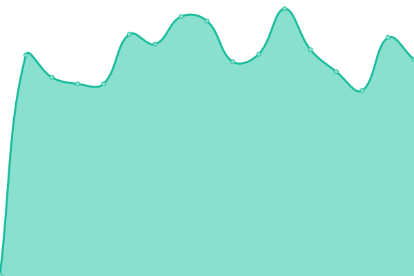

# [📈 Live Status](https://upptime.supersandro.de): <!--live status--> **🟧 Partial outage**

This repository contains the open-source uptime monitor and status page for [Sandro](https://supersandro.de/), powered by [Upptime](https://github.com/upptime/upptime).

With [Upptime](https://upptime.js.org), you can get your own unlimited and free uptime monitor and status page, powered entirely by a GitHub repository. We use [Issues](https://github.com/SuperSandro2000/upptime/issues) as incident reports, [Actions](https://github.com/SuperSandro2000/upptime/actions) as uptime monitors, and [Pages](https://upptime.supersandro.de) for the status page.

<!--start: status pages-->
<!-- This summary is generated by Upptime (https://github.com/upptime/upptime) -->
<!-- Do not edit this manually, your changes will be overwritten -->
<!-- prettier-ignore -->
| URL | Status | History | Response Time | Uptime |
| --- | ------ | ------- | ------------- | ------ |
|  [My website](https://supersandro.de) | 🟩 Up | [my-website.yml](https://github.com/SuperSandro2000/upptime/commits/HEAD/history/my-website.yml) | 

 779ms
     
 | 

<a href="https://upptime.supersandro.de/history/my-website">99.80%</a>
    

|  [Matrix redirection](https://supersandro.de/_matrix/key/v2/server) | 🟩 Up | [matrix-redirection.yml](https://github.com/SuperSandro2000/upptime/commits/HEAD/history/matrix-redirection.yml) | 

 198ms
     
 | 

<a href="https://upptime.supersandro.de/history/matrix-redirection">96.48%</a>
    

|  [Matrix Federation Tester](https://federationtester.matrix.org/api/report?server_name=supersandro.de) | 🟥 Down | [matrix-federation-tester.yml](https://github.com/SuperSandro2000/upptime/commits/HEAD/history/matrix-federation-tester.yml) | 

 4949ms
     
 | 

<a href="https://upptime.supersandro.de/history/matrix-federation-tester">94.74%</a>
    

|  [Ping matrix.supersandro.de](matrix.supersandro.de) | 🟥 Down | [ping-matrix-supersandro-de.yml](https://github.com/SuperSandro2000/upptime/commits/HEAD/history/ping-matrix-supersandro-de.yml) | 

 1491ms
     
 | 

<a href="https://upptime.supersandro.de/history/ping-matrix-supersandro-de">95.73%</a>
    

<!--end: status pages-->

[**Visit our status website →**](https://upptime.supersandro.de)

## 📄 License

- Powered by: [Upptime](https://github.com/upptime/upptime)
- Code: [MIT](./LICENSE) © [Sandro](https://supersandro.de/)
- Data in the `./history` directory: [Open Database License](https://opendatacommons.org/licenses/odbl/1-0/)
